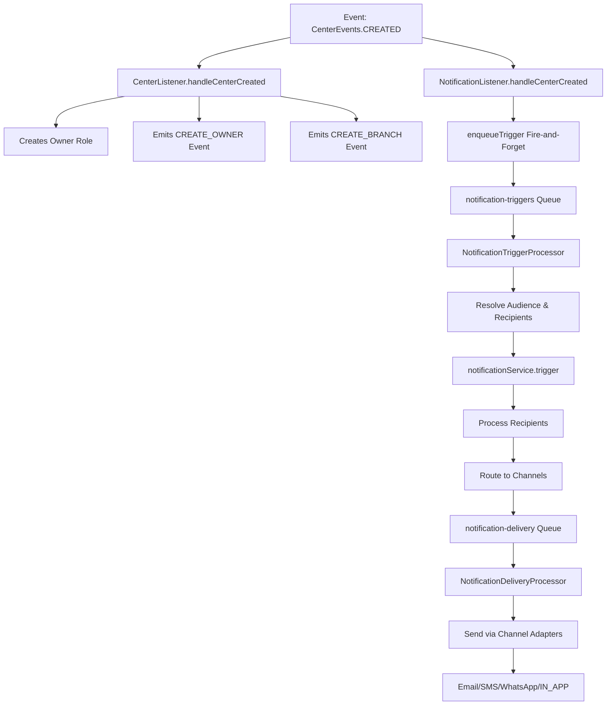

# Queue Entire Notification Trigger Process

## Problem

Currently, notification triggers are executed synchronously in event listeners. When notifications fail (e.g., missing template variables, database errors), the errors propagate and can block other event listeners from completing their work (e.g., user/branch creation in center creation events).

## Solution

Queue the entire notification trigger process using BullMQ with **two separate queues** for optimal isolation and scalability:

1. **`notification-triggers`** queue: Handles trigger jobs (decision, expansion, recipient resolution) - CPU+DB heavy
2. **`notification-delivery`** queue: Handles delivery jobs (sending via channels) - I/O heavy, rate-limited

Event listeners will enqueue trigger jobs (fire-and-forget) instead of calling `trigger()` synchronously. The trigger worker processes notifications completely outside the request/event context, then fans out to delivery jobs.

## Architecture Flow

## Implementation Steps

### 1. Create NotificationTriggerJobData Type

**File**: `src/modules/notifications/types/notification-trigger-job-data.interface.ts` (new file)Create a new interface to represent the data needed to trigger a notification. Note: Recipients are resolved inside the trigger worker, not passed in the job:

- `type: NotificationType`
- `audience: AudienceId` (recipients resolved in worker)
- `event: NotificationEvent | Record<string, unknown>`
- `channels?: NotificationChannel[]` (optional channel override)
- `correlationId?: string` (generated at enqueue time)

### 2. Register Two Queues in Module

**File**: `src/modules/notifications/notifications.module.ts`

- Add new queue registration for `'notification-triggers'`:
- Exponential backoff (3 attempts, 2s delay)
- Appropriate job retention settings
- Keep existing `'notifications'` queue as `'notification-delivery'` (or rename for clarity):
- This queue handles delivery jobs (already exists, may need renaming)
- Both queues use the same Redis connection

### 3. Update NotificationService

**File**: `src/modules/notifications/services/notification.service.ts`

- Add `@InjectQueue('notification-triggers')` injection in constructor
- Add new `enqueueTrigger()` method that:
- Generates `correlationId` at enqueue time (ensures it flows through entire process)
- Creates `NotificationTriggerJobData` from parameters (audience ID, not recipients)
- Enqueues job to `'notification-triggers'` queue with job name `'trigger-notification'`
- Uses exponential backoff (3 attempts, 2s delay)
- **Never throws** - logs errors but always succeeds (fire-and-forget)
- Includes structured logging with `correlationId`, `notificationType`, `audience`
- Handles queue failures gracefully (e.g., Redis down) - log error but don't throw
- Keep existing `trigger()` method unchanged (will be called by trigger processor)

### 4. Create NotificationTriggerProcessor

**File**: `src/modules/notifications/processors/notification-trigger.processor.ts` (new file)Create a new processor specifically for trigger jobs:

- Decorator: `@Processor('notification-triggers', { concurrency: 5 })`
- Inject `NotificationService`, `NotificationRouterService` (for enqueueing delivery jobs), and logger
- `process()` method:
- Validates `NotificationTriggerJobData`
- **Resolves audience to recipients** (this happens in worker, not listener)
- Calls `notificationService.trigger()` which handles:
    - Recipient validation
    - Template rendering
    - Channel routing
    - Enqueueing delivery jobs via `NotificationRouterService`
- **Classifies errors as retriable vs non-retriable**:
    - Non-retriable: `MissingTemplateVariablesException`, `InvalidRecipientException` (validation errors)
    - Retriable: DB timeouts, Redis hiccups, temporary service failures
- For non-retriable errors: log and mark as permanently failed (don't retry)
- For retriable errors: re-throw to trigger BullMQ retry mechanism
- Never waits for delivery jobs to complete (fire-and-forget fan-out)
- Ensure `correlationId` flows through all logs and error messages

### 5. Update NotificationDeliveryProcessor (Existing)

**File**: `src/modules/notifications/processors/notification.processor.ts`

- Rename file/class to `NotificationDeliveryProcessor` for clarity (or keep as-is if preferred)
- Update `@Processor('notification-delivery')` decorator (or keep 'notifications' if not renaming)
- This processor already handles `'send-notification'` jobs correctly
- No changes needed to delivery logic - it already works well
- Ensure `correlationId` flows through all logs

### 6. Update NotificationRouterService

**File**: `src/modules/notifications/services/routing/notification-router.service.ts`

- Update `@InjectQueue('notifications')` to `@InjectQueue('notification-delivery')` (or keep 'notifications' if not renaming queue)
- No other changes needed - this service already correctly enqueues delivery jobs
- Delivery jobs continue to be processed by the existing delivery processor

### 7. Update NotificationListenerHelper

**File**: `src/modules/notifications/listeners/helpers/notification-listener.helper.ts`

- Update `validateAndTriggerNotification()` to call `notificationService.enqueueTrigger()` instead of `notificationService.trigger()`
- Remove error re-throwing (line 144) since `enqueueTrigger()` never throws
- Keep validation logging for debugging but don't block execution
- Note: Recipients are no longer passed - only audience ID is enqueued (recipients resolved in trigger worker)

### 8. Add Non-Retriable Error Classification Helper

**File**: `src/modules/notifications/processors/notification-trigger.processor.ts`

- Create private helper method `isNonRetriableError(error: unknown): boolean` that:
- Checks if error is instance of `MissingTemplateVariablesException` (template validation failures)
- Checks if error is instance of `InvalidRecipientException` (recipient validation failures)
- Returns `true` for these validation errors (shouldn't retry - data issue, not transient)
- Returns `false` for DB/network/service errors (should retry)
- Use this in `process()` to classify errors and handle accordingly

## Key Benefits

1. **Complete Isolation**: Notifications never block business logic events
2. **Two-Queue Architecture**: Separation of concerns - triggers (CPU/DB) vs delivery (I/O)
3. **Backpressure Protection**: Slow delivery (SMS/email) won't block trigger processing
4. **Independent Scaling**: Scale trigger workers and delivery workers independently based on load
5. **Error Resilience**: Notification failures are handled within the queue system
6. **Request Context Independence**: All processing happens outside request/event context
7. **Backward Compatibility**: Existing `trigger()` method remains unchanged for direct calls
8. **Audience Resolution in Worker**: Recipients resolved inside trigger worker (proper boundary, handles large audiences)
9. **Smart Retry Strategy**: Non-retriable errors (validation) fail fast, retriable errors (network) use exponential backoff
10. **Observability**: Structured logging with correlationId enables end-to-end tracing
11. **Cost Efficiency**: Delivery retries don't block trigger jobs (delivery is expensive, triggers are cheap)

## Architectural Improvements Over Original Plan

Based on senior engineering review, the following refinements ensure production-grade quality:

1. **Two-Queue Architecture**: Separate `notification-triggers` (CPU/DB heavy) and `notification-delivery` (I/O heavy) queues for optimal isolation, scaling, and backpressure handling
2. **Audience Resolution in Worker**: Recipients resolved inside trigger worker (not in listener), enabling proper handling of large audiences and keeping payloads small
3. **Fire-and-Forget Fan-Out**: Trigger worker enqueues delivery jobs and exits immediately, never waiting for delivery completion
4. **Non-Retriable Error Classification**: Validation errors (missing templates, invalid recipients) fail immediately without wasting retries
5. **Correlation ID Enforcement**: Generated at enqueue time and flows through entire pipeline for complete observability
6. **Queue Failure Resilience**: Enqueue failures (Redis down) are logged but never thrown, ensuring business logic always succeeds
7. **Independent Processors**: Separate processors for triggers vs delivery enable independent scaling and clearer separation of concerns

## Testing Considerations

- Verify that event listeners complete even if notifications fail
- Ensure trigger jobs are properly enqueued and processed
- Verify delivery jobs are properly enqueued from trigger worker
- Test error scenarios (missing templates, invalid recipients) don't break events
- Verify correlation IDs flow correctly through the queue system (from enqueue → trigger → delivery jobs → logs)
- Test queue downtime scenarios (Redis down, BullMQ worker down) - events should still succeed
- Verify non-retriable errors are marked as failed immediately (no retries)
- Verify retriable errors trigger exponential backoff retries
- Test large audience scenarios (10k+ recipients) - verify chunking/fan-out works correctly
- Verify backpressure: slow delivery queue doesn't block trigger queue
- Test independent scaling: verify trigger and delivery workers can scale independently

## Files to Modify

1. `src/modules/notifications/types/notification-trigger-job-data.interface.ts` (new)
2. `src/modules/notifications/types/notification-trigger-job-data.interface.ts` (new)
3. `src/modules/notifications/notifications.module.ts`
4. `src/modules/notifications/services/notification.service.ts`
5. `src/modules/notifications/processors/notification-trigger.processor.ts` (new)
6. `src/modules/notifications/services/routing/notification-router.service.ts`
7. `src/modules/notifications/listeners/helpers/notification-listener.helper.ts`

## Important Implementation Notes

### Queue Naming Strategy

**Option A (Recommended)**: Rename existing queue for clarity

- `'notifications'` → `'notification-delivery'`
- Requires updating all references to the queue

**Option B (Minimal Change)**: Keep existing name, add new queue

- Keep `'notifications'` as delivery queue
- Add `'notification-triggers'` as new queue
- Less disruptive, but naming is less clear

### Recipient Resolution

The trigger job data should **NOT** include recipients. Instead:

- Listener passes `audienceId` (e.g., 'OWNER', 'ADMIN', 'DEFAULT')
- Trigger processor resolves audience to recipients using existing recipient resolution logic
- This enables proper handling of large audiences and keeps payloads small