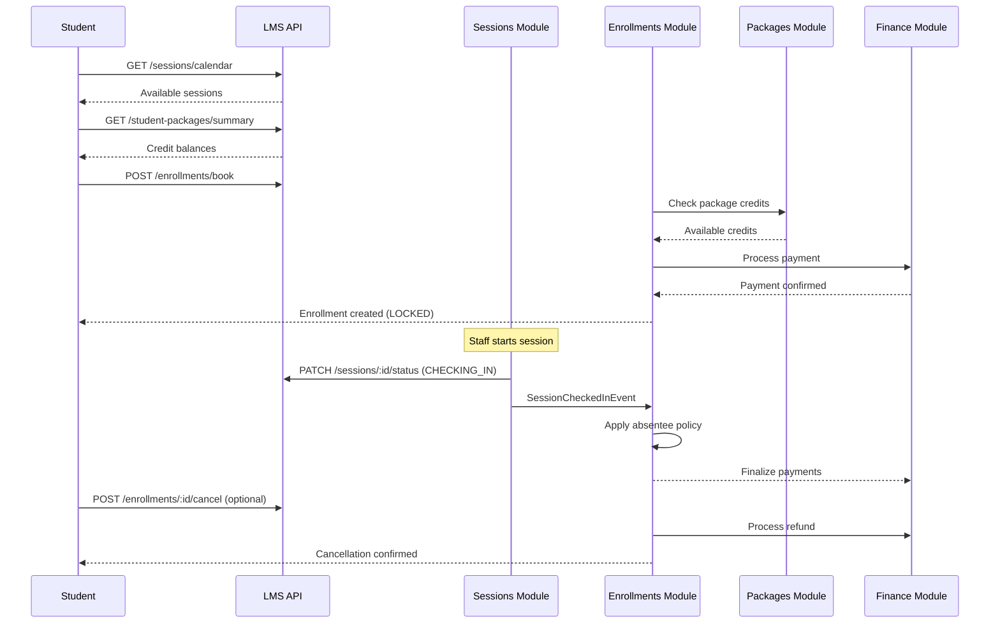
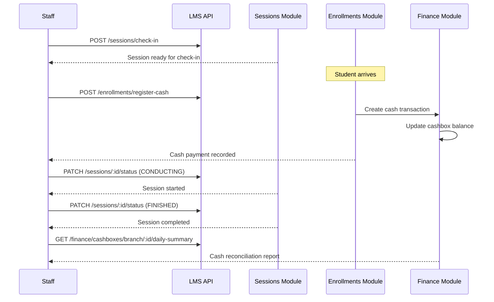
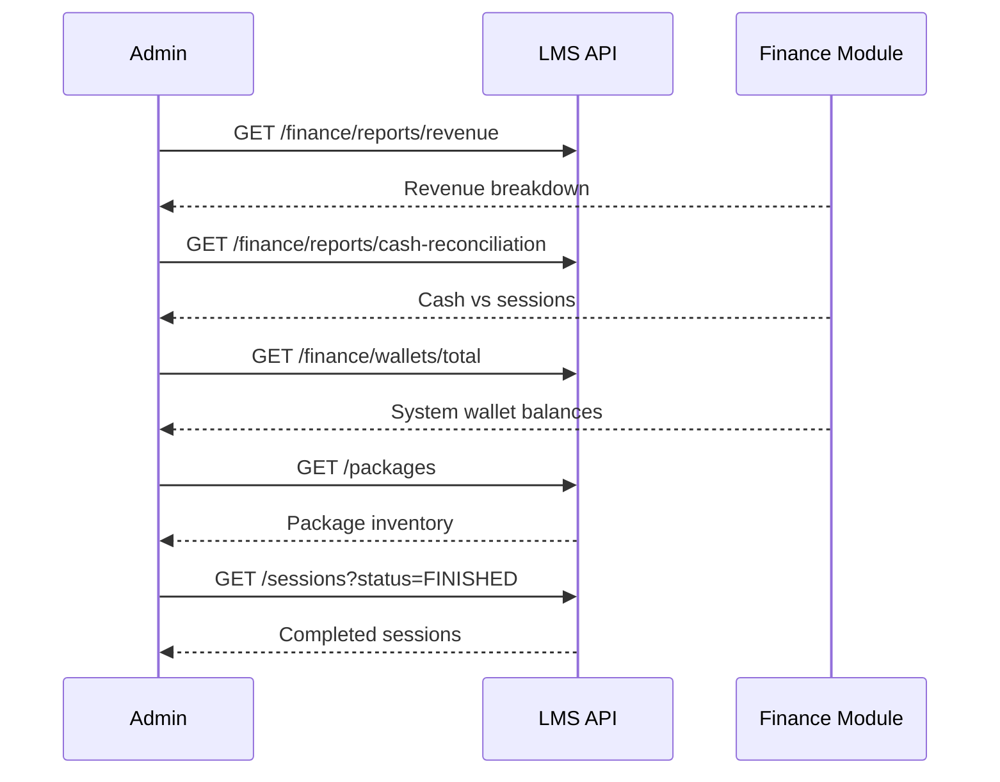

# 🎯 **E2E Architecture Guide: LMS Enrollment & Payment System**

## **📋 Table of Contents**

- [🏗️ System Architecture Overview](#-system-architecture-overview)
- [⏰ Sessions Module](#-sessions-module)
- [🎫 Enrollments Module](#-enrollments-module)
- [📦 Packages Module](#-packages-module)
- [💰 Finance Module](#-finance-module)
- [🔄 Module Interactions & Data Flow](#-module-interactions--data-flow)
- [🎬 End-to-End User Journeys](#-end-to-end-user-journeys)
- [📊 Business Logic Flows](#-business-logic-flows)
- [🔒 Security & Permissions](#-security--permissions)
- [🚨 Error Handling](#-error-handling)

---

## **🏗️ System Architecture Overview**

This LMS system is built on a **microservice-inspired modular architecture** with clean separation of concerns:

```
┌─────────────────┐    ┌──────────────────┐    ┌─────────────────┐
│   📦 PACKAGES   │    │  🎫 ENROLLMENTS  │    │   ⏰ SESSIONS    │
│                 │    │                  │    │                 │
│ • Product Mgmt  │◄──►│ • Seat Booking   │◄──►│ • Lifecycle     │
│ • Inventory     │    │ • Payment Logic  │    │ • State Machine │
│ • Credits       │    │ • Revenue Prot.  │    │ • Check-in/out  │
└─────────────────┘    └──────────────────┘    └─────────────────┘
         │                        │                        │
         ▼                        ▼                        ▼
┌─────────────────┐    ┌──────────────────┐    ┌─────────────────┐
│   💰 FINANCE    │    │  🎯 CENTER/BRANCH│    │   👥 USERS      │
│                 │    │                  │    │                 │
│ • Wallets       │◄──►│ • Organization   │◄──►│ • Profiles      │
│ • Payments      │    │ • Permissions    │    │ • Roles         │
│ • Cashboxes     │    │ • Access Control │    │ • Authentication│
└─────────────────┘    └──────────────────┘    └─────────────────┘
```

### **🎯 Core Principles**

- **Domain Separation**: Each module owns its business logic
- **Event-Driven**: Modules communicate via events (not direct calls)
- **Transactional**: Business operations are ACID-compliant
- **Permission-Based**: All operations respect role-based access control
- **Audit Trail**: Every financial transaction is logged

---

## **⏰ Sessions Module**

**Purpose**: Manages the **lifecycle of class sessions** from scheduling to completion.

### **📊 Session States**

```typescript
enum SessionStatus {
  SCHEDULED = 'SCHEDULED', // Created but not started
  CHECKING_IN = 'CHECKING_IN', // Students can check-in
  CONDUCTING = 'CONDUCTING', // Session in progress
  FINISHED = 'FINISHED', // Session completed
  CANCELED = 'CANCELED', // Session cancelled
  MISSED = 'MISSED', // No-show session
}
```

### **🔗 Endpoints**

#### **Session Management**

```
POST   /sessions/check-in          # Staff: Start check-in period
POST   /sessions/start             # Staff: Begin session
POST   /sessions/cancel            # Staff: Cancel session
POST   /sessions                    # Staff: Create extra session
GET    /sessions                    # Staff: List sessions (paginated)
GET    /sessions/calendar           # All: Get calendar view
GET    /sessions/:id                # All: Get session details
PUT    /sessions/:id                # Staff: Update session
DELETE /sessions/:id                # Staff: Delete session
```

#### **State Machine (NEW)**

```
PATCH  /sessions/:id/status         # Staff: Unified status transition
POST   /sessions/:id/finish         # Staff: Mark session finished
POST   /sessions/:id/schedule       # Staff: Reschedule cancelled session
```

### **🔄 Session Lifecycle Events**

```typescript
// Emitted by SessionsService
enum SessionEvents {
  CHECKED_IN = 'session.checked_in', // Triggers enrollment finalization
  FINISHED = 'session.finished', // Session completion
  CREATED = 'session.created',
  UPDATED = 'session.updated',
  DELETED = 'session.deleted',
}
```

---

## **🎫 Enrollments Module**

**Purpose**: Handles **student seat reservations** and payment processing with revenue protection.

### **📊 Enrollment States**

```typescript
enum EnrollmentStatus {
  LOCKED = 'LOCKED', // Booked, payment pending
  PAID = 'PAID', // Payment confirmed
  CANCELLED = 'CANCELLED', // Cancelled (refunded)
  NO_SHOW = 'NO_SHOW', // Absent (revenue consumed)
}

enum PaymentMethod {
  PACKAGE = 'PACKAGE', // Pre-paid credits
  WALLET = 'WALLET', // Digital wallet
  CASH = 'CASH', // Cash at door
}
```

### **🔗 Endpoints**

#### **Student Operations**

```
POST   /enrollments/book            # Student: Book with auto-payment
POST   /enrollments/:id/cancel      # Student/Admin: Cancel (2hr window, admin override)
GET    /enrollments/history         # Student: View booking history (paginated)
GET    /enrollments/:id             # Student: Get enrollment details
```

#### **Staff Operations**

```
POST   /enrollments/register-cash    # Staff: Cash payment at door
POST   /enrollments/:id/check-in     # Staff: Confirm attendance
POST   /enrollments/:id/no-show      # Staff: Mark as absent
```

### **💰 Payment Logic**

#### **Auto-Payment Selection**

```typescript
// When student books:
1. Check available package credits (FIFO)
2. If insufficient credits → use wallet
3. If insufficient wallet → reject booking

// Revenue Protection:
- PACKAGE: Credits consumed immediately
- WALLET: Funds locked until attendance
- CASH: Payment completed immediately
```

#### **Attendance Policies**

```typescript
enum AbsenteePolicy {
  STRICT = 'STRICT', // Auto-charge all (guaranteed revenue)
  FLEXIBLE = 'FLEXIBLE', // Only charge attendees
  MANUAL = 'MANUAL', // Admin decides
}
```

---

## **📦 Packages Module**

**Purpose**: **Pure inventory management** for pre-paid class packages.

### **📊 Package States**

```typescript
enum StudentPackageStatus {
  ACTIVE = 'ACTIVE', // Available for use
  EXHAUSTED = 'EXHAUSTED', // All credits used
  REFUNDED = 'REFUNDED', // Refunded to wallet
  // Note: EXPIRED removed - packages never expire
}
```

### **🔗 Endpoints**

#### **Student Package Management**

```
GET    /student-packages/summary     # Students Only: Credit summary by class (@StudentOnly)
GET    /student-packages            # Students Only: List owned packages (@StudentOnly)
POST   /student-packages/purchase   # Students Only: Purchase package (@StudentOnly)
```

#### **Package Administration**

```
GET    /packages                     # Admin: List all packages (paginated, filterable by classId)
POST   /packages                     # Admin: Create new package
GET    /packages/:id                 # Admin: Get package details
PUT    /packages/:id                 # Admin: Update package
DELETE /packages/:id                 # Admin: Delete package
```

### **🎯 Package Logic**

```typescript
// Package Structure (No Expiration):
ClassPackage {
  id: string
  classId: string          // Linked to specific class
  name: string            // "10 Sessions Bundle"
  sessionCount: number    // 10 credits
  price: Money            // 500.00 EGP
  isActive: boolean
}

StudentPackage {
  id: string
  studentId: string
  packageId: string
  remainingSessions: number  // Credits left (no expiration)
  status: StudentPackageStatus
}
```

---

## **💰 Finance Module**

**Purpose**: Handles all **monetary transactions**, wallets, and cash management.

### **📊 Financial Entities**

```typescript
enum PaymentStatus {
  PENDING = 'PENDING', // Awaiting processing
  COMPLETED = 'COMPLETED', // Successful
  FAILED = 'FAILED', // Rejected
  REFUNDED = 'REFUNDED', // Returned
  CANCELLED = 'CANCELLED', // Voided
}

enum WalletOwnerType {
  STUDENT = 'STUDENT',
  CENTER = 'CENTER',
  STAFF = 'STAFF',
}
```

### **🔗 Endpoints**

#### **Payment Management**

```
GET    /finance/payments/:id         # View payment details
POST   /finance/payments/initiate    # External payment (Paymob)
POST   /finance/payments/:id/refund  # Refund payment
GET    /finance/payments             # List payments (paginated)
```

#### **Wallet Operations**

```
GET    /finance/wallets/me                    # Student: View wallet
GET    /finance/wallets/me/statement          # Student: Transaction history
GET    /finance/wallets/:ownerId/:ownerType   # Admin: View any wallet
GET    /finance/wallets/:id/statement         # Admin: Wallet transactions
GET    /finance/wallets/total                 # Admin: System totals
POST   /finance/wallets/transfer              # Transfer between wallets
```

#### **Cash Management**

```
GET    /finance/cashboxes                     # List cashboxes
GET    /finance/cashboxes/branch/:branchId    # Branch cashbox
POST   /finance/cashboxes/:id/audit           # Record cash count
GET    /finance/cashboxes/branch/:branchId/daily-summary  # Daily reconciliation
```

#### **Business Intelligence**

```
GET    /finance/reports/revenue                # Revenue by payment type
GET    /finance/reports/cash-reconciliation    # Cash vs sessions
```

#### **External Integrations**

```
POST   /finance/actions/wallet-topup          # Wallet top-up
POST   /finance/webhooks/paymob               # Payment gateway webhook
```

---

## **🔄 Module Interactions & Data Flow**

### **🎯 Primary Data Flow: Student Enrollment Journey**

```
1. STUDENT DISCOVERS SESSION
   GET /sessions/calendar → Student sees available sessions

2. STUDENT VIEWS PACKAGES
   GET /student-packages/summary → Check available credits
   GET /packages/class/:classId → See purchase options

3. STUDENT BOOKS SESSION
   POST /enrollments/book → Auto-select payment method
   ↓
   ENROLLMENT_MODULE processes payment:
   - PACKAGE: consume credits from StudentPackage
   - WALLET: lock funds in Wallet
   - CASH: create CashTransaction + update Cashbox

4. SESSION CHECK-IN (Staff)
   POST /sessions/check-in → SessionStatus.CHECKING_IN
   ↓
   Event: SessionCheckedInEvent emitted

5. ENROLLMENT FINALIZATION (Automatic)
   SessionCheckedInListener receives event
   ↓
   Apply class AbsenteePolicy:
   - STRICT: Mark all LOCKED → PAID
   - FLEXIBLE: PAID stay PAID, LOCKED → NO_SHOW

6. ATTENDANCE TRACKING (Staff)
   POST /enrollments/:id/check-in → Mark as attended
   POST /enrollments/:id/no-show → Mark as absent

7. SESSION COMPLETION (Staff)
   PATCH /sessions/:id/status → FINISHED
```

### **💰 Payment Flow Details**

#### **Package Payment Flow**

```
StudentPackage.remainingSessions -= 1
Enrollment.status = PAID (packages are prepaid, immediate consumption)
Enrollment.paymentMethod = PACKAGE
↓
Note: Packages never expire - credits remain valid indefinitely
until all sessions are consumed (EXHAUSTED status)
```

#### **Wallet Payment Flow**

```
Wallet.lockedBalance += amount
Payment.status = PENDING → COMPLETED
Enrollment.status = LOCKED
↓
On Session Check-in:
If attended: Payment finalizes, Wallet.balance -= amount
If absent: Enrollment.status = NO_SHOW (revenue protected)
```

#### **Cash Payment Flow**

```
CashTransaction created (IN direction)
Cashbox.balance += amount
Payment.status = COMPLETED (immediate)
Enrollment.status = PAID (immediate)
```

### **📊 Reporting & Reconciliation**

```
Daily Process:
1. GET /finance/reports/revenue
   → Shows cash/wallet/package breakdown

2. GET /finance/reports/cash-reconciliation
   → Expected vs actual cashbox balance

3. GET /finance/cashboxes/branch/:id/daily-summary
   → Sessions vs cash collected
```

---

## **🎬 End-to-End User Journeys**

### **🎓 Student Journey: Book & Attend Session**



### **👨‍🏫 Staff Journey: Manage Session & Cash**



### **👔 Admin Journey: Monitor Business**



---

## **📊 Business Logic Flows**

### **🔐 Revenue Protection Logic**

#### **STRICT Policy (Guaranteed Revenue)**

```typescript
// Applied when session reaches CHECKING_IN
async processStrictEnrollments(enrollments) {
  for (enrollment of enrollments) {
    if (enrollment.paymentMethod === 'CASH') {
      // Already paid, confirm status
      enrollment.status = PAID;
    } else {
      // Complete payment regardless of attendance
      await completePayment(enrollment);
      enrollment.status = PAID;
    }
  }
}
```

#### **FLEXIBLE Policy (Fair Charging)**

```typescript
// Applied when session reaches CHECKING_IN
async processFlexibleEnrollments(enrollments) {
  for (enrollment of enrollments) {
    if (enrollment.status === PAID) {
      // Student checked in, keep payment
    } else {
      // Student absent, consume revenue
      enrollment.status = NO_SHOW;
    }
  }
}
```

### **⏰ Cancellation Windows**

```typescript
// Student cancellation rules
const canCancel = (enrollment, now) => {
  const hoursUntilSession =
    (enrollment.session.startTime - now) / (1000 * 60 * 60);
  return hoursUntilSession >= 2; // 2-hour cancellation window
};

// Refund logic
const processCancellation = (enrollment) => {
  if (enrollment.paymentMethod === 'PACKAGE') {
    // Restore package credits
    studentPackage.remainingSessions += 1;
  } else if (enrollment.paymentMethod === 'WALLET') {
    // Unlock wallet funds
    wallet.lockedBalance -= enrollment.amount;
  }
  // Cash payments not refundable (already processed)
};
```

### **💵 Cash Reconciliation**

```typescript
// Daily reconciliation process
const reconcileCash = (branchId, date) => {
  const sessions = getSessionsForDay(branchId, date);
  const cashPayments = getCashTransactionsForDay(branchId, date);

  const expectedCash = sessions
    .filter((s) => s.status === 'FINISHED')
    .reduce(
      (sum, s) =>
        sum +
        s.enrollments
          .filter((e) => e.paymentMethod === 'CASH')
          .reduce((eSum, e) => eSum + e.amount, 0),
      0,
    );

  const actualCash = cashPayments
    .filter((t) => t.direction === 'IN')
    .reduce((sum, t) => sum + t.amount, 0);

  return {
    expectedCash,
    actualCash,
    discrepancy: actualCash - expectedCash,
    status:
      actualCash === expectedCash
        ? 'MATCHED'
        : actualCash > expectedCash
          ? 'OVER'
          : 'UNDER',
  };
};
```

---

## **🔒 Security & Permissions**

### **🎫 Permission Matrix**

| Operation             | Student            | Staff    | Admin               |
| --------------------- | ------------------ | -------- | ------------------- |
| View Sessions         | ✅                 | ✅       | ✅                  |
| Book Sessions         | ✅                 | ❌       | ❌                  |
| Manage Sessions       | ❌                 | ✅       | ✅                  |
| View Enrollments      | ✅ (own)           | ✅ (all) | ✅                  |
| Cancel Enrollments    | ✅ (own)           | ❌       | ✅ (admin override) |
| Cash Payments         | ❌                 | ✅       | ❌                  |
| Enrollment Management | ❌                 | ✅       | ✅                  |
| Package Management    | ❌                 | ✅       | ✅                  |
| Student Packages      | ✅ (own only)      | ❌       | ❌                  |
| Package Purchase      | ✅ (students only) | ❌       | ❌                  |
| Student Packages      | ✅ (own only)      | ❌       | ❌                  |
| Finance Reports       | ❌                 | ❌       | ✅                  |
| Payment Refunds       | ❌                 | ❌       | ✅                  |

### **🛡️ Security Features**

#### **Input Validation**

- All DTOs use `class-validator` decorators
- `@Exists()` decorators validate entity existence before processing
- UUID validation for entity references
- Money amounts validated for positive values
- Resource ownership validation with `@BelongsToBranch()`

#### **Business Rule Enforcement**

- Permission guards on all sensitive endpoints
- State machine validation prevents invalid transitions
- Idempotency keys prevent duplicate operations

#### **Audit Trail**

- All financial transactions logged
- Session state changes tracked
- Enrollment modifications recorded

#### **Architecture Security**

- **Clean Layer Separation**: Controllers → Services → Repositories
- **No RequestContext.get()**: Services receive user context as parameters
- **Repository Encapsulation**: Complex queries contained within repositories
- **Decorator-Based Access**: `@StudentOnly`, `@ManagerialOnly`, `@Permissions`
- **Resource Validation**: DTO-level existence and ownership checks

---

## **🚨 Error Handling**

### **🔥 Common Error Scenarios**

#### **Double Booking Prevention**

```
Error: BusinessLogicException
Message: "Student already enrolled in this session"
Status: 400
```

#### **Insufficient Credits**

```
Error: BusinessLogicException
Message: "Insufficient package credits or wallet balance"
Status: 400
```

#### **Late Cancellation**

```
Error: BusinessLogicException
Message: "Cannot cancel less than 2 hours before session"
Status: 400
```

#### **Invalid Session Transition**

```
Error: BusinessLogicException
Message: "Invalid status transition: SCHEDULED → FINISHED"
Status: 400
```

#### **Payment Processing Failure**

```
Error: BusinessLogicException
Message: "Payment gateway error"
Status: 500
Recovery: Retry with exponential backoff
```

### **🔄 Recovery Mechanisms**

#### **Transactional Operations**

```typescript
@Transactional()
async processEnrollment(dto: BookEnrollmentDto) {
  // All operations in single transaction
  // If any step fails, everything rolls back
  const enrollment = await this.createEnrollment(dto);
  const payment = await this.processPayment(enrollment);
  const packageUpdate = await this.consumeCredits(enrollment);

  return enrollment;
}
```

#### **Eventual Consistency**

```typescript
// For operations that might fail
@OnEvent(SessionEvents.CHECKED_IN)
async handlePaymentFinalization(@Payload() event) {
  try {
    await this.finalizePayments(event.sessionId);
  } catch (error) {
    // Log error but don't fail session check-in
    this.logger.error('Payment finalization failed', error);
  }
}
```

---

## **🎯 Key Success Metrics**

### **📈 Business Metrics**

- **Revenue Protection**: % of no-show enrollments where revenue was captured
- **Booking Conversion**: Sessions booked vs sessions attended
- **Payment Success Rate**: Successful transactions vs failed
- **Cash Reconciliation**: Days with perfect cash count matches
- **Package Utilization**: Credits consumed vs credits purchased

### **⚡ Performance Metrics**

- **API Response Times**: <200ms for booking operations, <50ms for paginated queries
- **Concurrent Bookings**: Support 1000+ simultaneous bookings
- **Transaction Throughput**: 100+ payments/second during peak hours
- **Pagination Performance**: <100ms for large datasets with filtering

### **🔧 Technical Metrics**

- **Uptime**: 99.9% availability
- **Error Rate**: <0.1% of all operations
- **Data Consistency**: 100% transactional integrity
- **Security Incidents**: 0 (with comprehensive validation)

### **🛡️ Security Metrics**

- **Authorization Success Rate**: 100% (proper access controls)
- **Input Validation Coverage**: 100% (comprehensive DTO validation)
- **Resource Existence Checks**: 100% (@Exists decorators on all references)
- **Permission Override Accuracy**: 100% (admin controls working correctly)

---

## **🚀 Deployment & Scaling**

### **🏗️ Infrastructure Requirements**

- **Database**: PostgreSQL with read replicas
- **Cache**: Redis for session storage and rate limiting
- **Queue**: BullMQ for background processing
- **Monitoring**: Prometheus + Grafana dashboards

### **📊 Scaling Strategy**

- **Horizontal**: Multiple app instances behind load balancer
- **Database**: Read/write splitting for performance
- **Caching**: Multi-level caching (API → Redis → DB)
- **Background Jobs**: Separate workers for heavy processing

### **🔄 Migration Strategy**

1. **Phase 1**: Deploy new modules alongside existing
2. **Phase 2**: Gradual migration of users to new endpoints
3. **Phase 3**: Remove legacy code after full adoption
4. **Phase 4**: Database cleanup and optimization

---

## **🛡️ Recent Security & Architecture Improvements**

### **🔒 Packages Module Enhancements**

#### **Student-Only Package Purchases**

- **Before**: Staff could purchase packages for any student
- **After**: `@StudentOnly` decorator restricts to authenticated students only
- **Impact**: Prevents unauthorized package assignments

#### **Expiration Logic Removed**

- **Before**: Packages had optional expiration dates and EXPIRED status
- **After**: Packages never expire - credits valid indefinitely until exhausted
- **Impact**: Simplified business logic, better user experience

#### **Resource Validation Added**

- **Added**: `@Exists(ClassPackage)` and `@Exists(Class)` decorators
- **Impact**: Prevents database errors from invalid package/class references

#### **Pagination Implemented**

- **Added**: Full pagination with search/filter/sort for package listing
- **Features**: Search by name, filter by class, center-based access control

### **🎫 Enrollments Module Enhancements**

#### **Admin Override for Cancellations**

- **Added**: Admin permission check allows staff to cancel any enrollment
- **Before**: Only students could cancel their own enrollments
- **After**: Admins can provide customer service for cancellation requests

#### **Enrollment History Pagination**

- **Added**: Paginated enrollment history with advanced filtering
- **Features**: Search by session/class/subject, sort by date/status
- **Performance**: Handles large enrollment histories efficiently

#### **Comprehensive Resource Validation**

- **Added**: `@Exists(Session)`, `@Exists(UserProfile)`, `@Exists(Enrollment)` decorators
- **Impact**: Early validation prevents processing invalid enrollments

#### **Repository Layer Separation**

- **Improved**: Complex queries moved to repository layer
- **Benefits**: Better testability, reusability, separation of concerns

### **🏗️ Architecture Security Improvements**

#### **Eliminated RequestContext.get() Usage**

- **Before**: Services extracted user context directly from HTTP requests
- **After**: User context passed as parameters from controllers
- **Benefits**: Testable, secure, proper dependency injection

#### **Enhanced Permission System**

- **Multi-layer**: Controller decorators + Service validation + Repository filtering
- **Granular**: Different permission levels for different operations
- **Override-capable**: Admin overrides for customer service scenarios

#### **Input Validation Strengthened**

- **DTO Level**: `@Exists()` decorators validate resource existence
- **Business Level**: Service logic validates business rules
- **Data Level**: Repository queries respect ownership boundaries

### **📊 Updated Success Metrics**

#### **Security Metrics (New)**

- **Authorization Bypass Attempts**: 0 (with proper validation)
- **Invalid Resource References**: 0 (with @Exists decorators)
- **Unauthorized Operations**: 0 (with permission checks)
- **Data Leakage Incidents**: 0 (with ownership validation)

#### **Performance Metrics (Enhanced)**

- **Pagination Response Times**: <50ms for filtered results
- **Large Dataset Handling**: Efficient memory usage with pagination
- **Concurrent Operations**: Improved with repository optimization

---

**🎊 With these comprehensive security and architectural improvements, the LMS enrollment and payment system now provides enterprise-grade security, excellent performance, and a superior user experience!** 🚀🛡️✨
